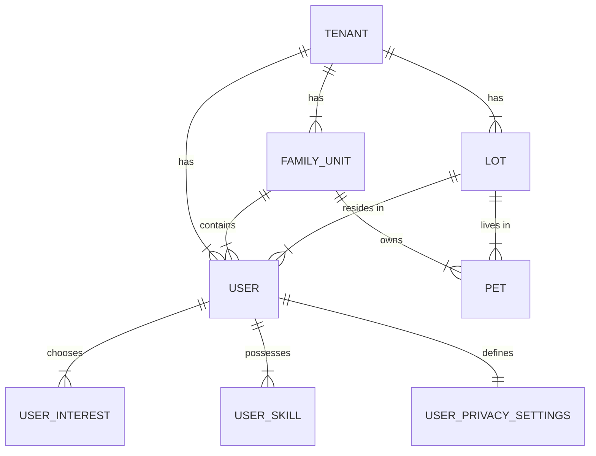

# Neighbor Directory: Data Model

The Resident Directory is built on a multi-tenant relational model that prioritizes data isolation and household grouping.

## Core Schema

### Core Entities
- **Users (`users`)**: The central entity representing residents, admins, and super admins.
    - `role`: Defines access level (`resident`, `tenant_admin`, `super_admin`).
    - `tenant_id`: Ensures strict multi-tenant isolation.
- **Family Units (`family_units`)**: Represents a household. Residents are linked via `family_unit_id`.
    - `primary_contact_id`: Links back to a specific User.
- **Lots (`lots`)**: Physical locations within the community. Users belong to a lot via `lot_id`.
- **Pets (`pets`)**: Community-registered animals, linked to both a family unit and a physical lot.

### Extension Entities
- **Interests & Skills**:
    - `interests` / `skills`: Global catalogs of community tags.
    - `user_interests` / `user_skills`: Join tables for resident profiling.
- **Privacy Settings (`user_privacy_settings`)**: User-defined visibility flags for various PII fields.

## Background Logic

### Data Synchronization
The application ensures that resident data stays consistent with their household context:
- **Family Management**: When residents are added to a family, their privacy settings and lot associations are often inherited or reconciled via server actions in `app/actions/profile.ts`.
- **Tenant Context**: All data fetching (via `lib/data/residents.ts`) is scoped to the `tenantId` extracted from the URL slug or user session.

### Server Actions
- `createResidentRequest`: Handles maintenance and complaint workflow, tagging residents or pets as needed.
- `updateResidentProfile`: A transaction-like flow that updates core user data, interests, and skills simultaneously.
- `neighbor-lists`: Allows residents to create private grouping of community members for quick access.

## Relationship Diagram

